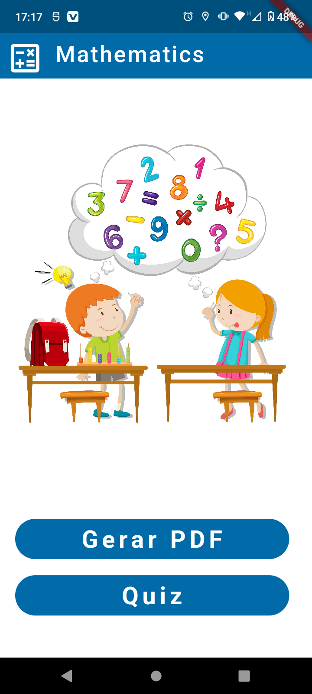
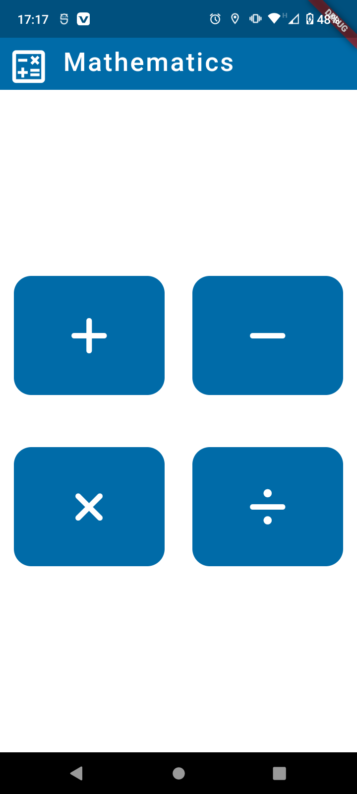
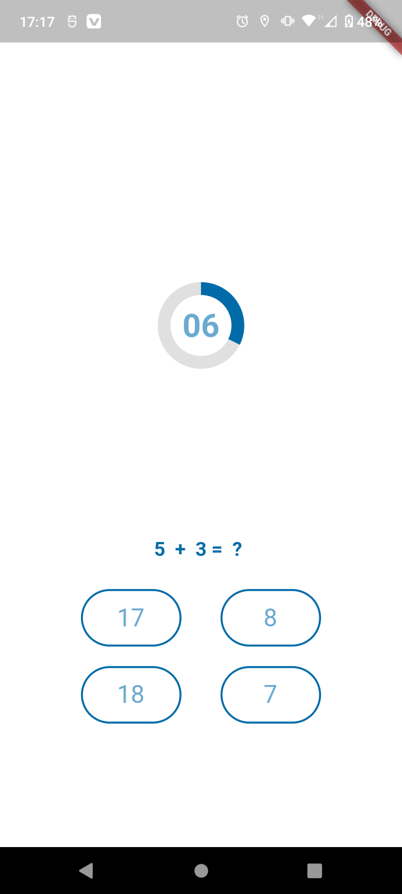
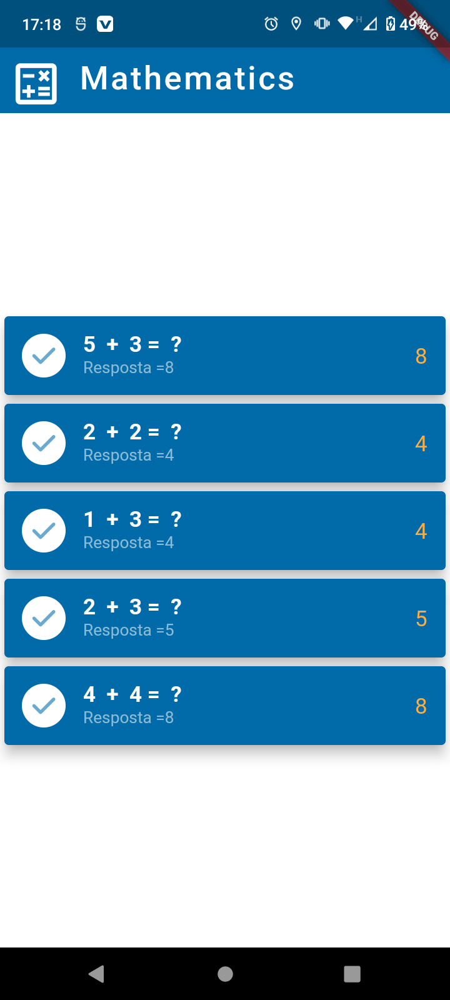
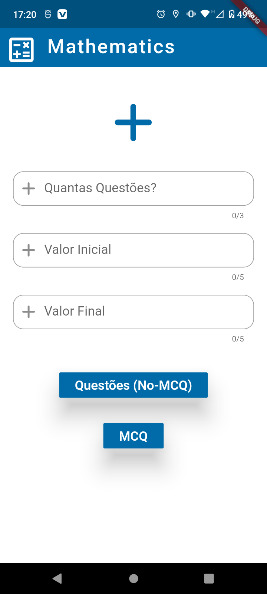
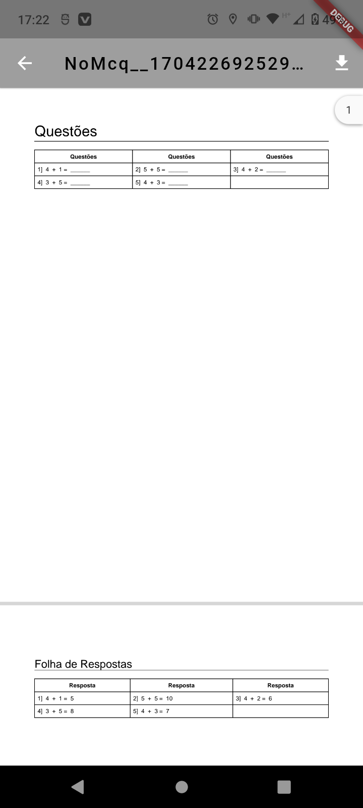

# Mathematics flutter

Mathematics Flutter is a collection of mathematical functions and tools that can be used in a variety of applications. The project includes functions for performing basic arithmetic operations (addition, subtraction, multiplication, division), working with matrices, calculating statistical measures, and more. Additionally, the project supports generating multiple choice question (MCQ) and question with answer PDFs, quizzes, web, and PWA support for desktop.

# Features
* Basic arithmetic operations: Addition, subtraction, multiplication, division
* Working with matrices
* Calculating statistical measures
* Generating MCQ PDFs
* Generating question PDFs with answers
* Quizzes
* Web support
* PWA support for desktop

# Demo
You can try a live demo of Mathematics Flutter at https://jaygajjar.ml/Mathematics/

# Getting Started

To get started with this project, follow these steps:

* Clone the project to your local machine.
* Open the project in your preferred IDE or text editor.
* Run `flutter pub get` to install the required dependencies.

      

# Internationalization PT_BR Screenshots

# Contributing
Contributions are welcome and encouraged! If you find a bug, have a suggestion for improvement, or want to add a feature, feel free to submit a pull request or open an issue.

